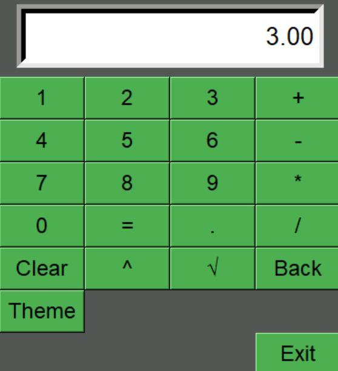
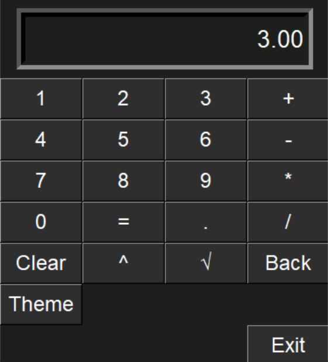

# Advanced Calculator with Tkinter

A simple, user-friendly advanced calculator application built 
using Python's Tkinter GUI framework.

---

## Screenshots

## Features
- Standard operations: `+`, `-`, `*`, `/`, `^`
- Square root calculation (`√`)
- Decimal support
- Backspace functionality
- Light/Dark theme toggle
- Clear and Exit buttons
- Exception handling (division by zero, invalid input, etc.)
- Result rounding to 2 decimal places

## Requirements
- **Python 3.x** 
- Standard library only (no external dependencies)

## Usage
- Click buttons to input your expression.
- √ for square root (of the entire expression).
- ^ for power (2^3 → 8).
- Back to delete last character.
- Theme to toggle dark/light mode.
- Press = to calculate.

## Note
This app uses Python's **eval()** function to evaluate expressions. 
Use with caution for untrusted input.

## **Unit tests**
This project includes a **test_calculator.py** file, containing unit tests.
Code coverage can be measured using the Coverage package (non-built-in module).

## Future improvements
- Add keyboard support
- Refactor to OOP
- Implement expression parser (avoid eval)
- Add memory functions (M+, M-, MR)
- Add more unit tests to increase code coverage

## License
This project is licensed under the MIT License.
